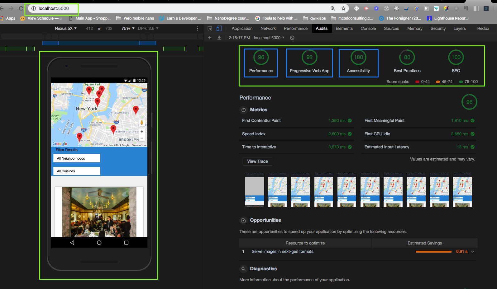

# Mobile Web Specialist Certification Course

---

#### _Three Stage Course Material Project - Restaurant Reviews_

## Project Overview: Stage 1 and Stage 2

### Stage 1

For the **Restaurant Reviews** projects, you will incrementally convert a static webpage to a mobile-ready web application. In **Stage One**, you will take a static design that lacks accessibility and convert the design to be responsive on different sized displays and accessible for screen reader use. You will also add a service worker to begin the process of creating a seamless offline experience for your users.

#### Project Overview

For the Restaurant Reviews projects, you will incrementally convert a static webpage to a mobile-ready web application. In Stage One, you will take a static design that lacks accessibility and convert the design to be responsive on different sized displays and accessible for screen reader use. You will also begin converting this to a Progressive Web Application by caching some assets for offline use.

#### Specification

You have been provided the code for a restaurant reviews website. The code has a lot of issues. It’s barely usable on a desktop browser, much less a mobile device. It also doesn’t include any standard accessibility features, and it doesn’t work offline at all. Your job is to update the code to resolve these issues while still maintaining the included functionality.

> In this real world case study, given the front end code for a static Restaurant Reviews App, revise the site to be responsive and achieve accessibility standards.

### Stage 2

In **Stage two**, the client application should pull restaurant data from the development server, parse the JSON response, and use the information to render the appropriate sections of the application UI.

The client application works offline. JSON responses are cached using the IndexedDB API. Any data previously accessed while connected is reachable while offline.

#### Performance Specifications

Lighthouse targets for each category exceed:

- Progressive Web App: >90
- Performance: >70
- Accessibility: >90

## Requirements

Make the provided site fully responsive. All of the page elements should be usable and visible in any viewport, including desktop, tablet, and mobile displays. Images shouldn't overlap, and page elements should wrap when the viewport is too small to display them side by side.

Make the site accessible. Using what you've learned about web accessibility, ensure that alt attributes are present and descriptive for images. Add screen-reader-only attributes when appropriate to add useful supplementary text. Use semantic markup where possible, and aria attributes when semantic markup is not feasible.

Cache the static site for offline use. Using Cache API and a ServiceWorker, cache the data for the website so that any page (including images) that has been visited is accessible offline.

## Project URL on Github

https://github.com/rproenza86/mws-restaurant-stage-1

## Acceptance criteria

https://review.udacity.com/#!/rubrics/1090/view

## Style guide

http://udacity.github.io/frontend-nanodegree-styleguide/index.html

## Stage 2 Performance Results

